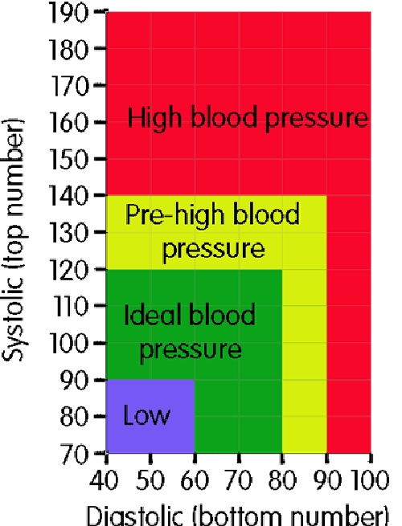
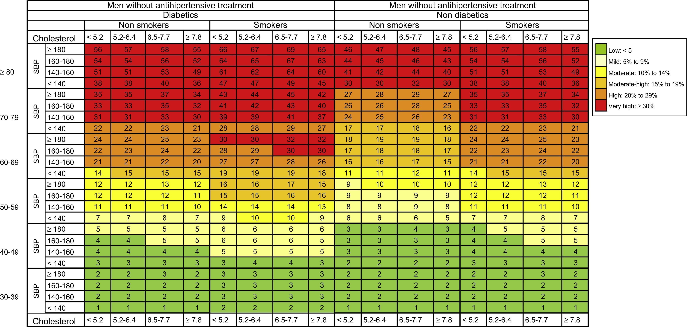
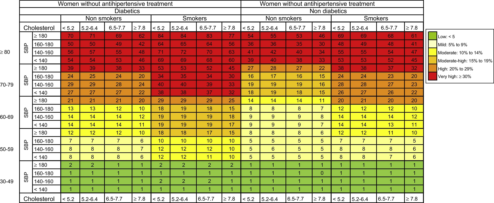

# Heart Health Program

## What did I use? ⚙️

I used these 3 graphics as my reference:

## What were 3 things I learned? 🧠

- An ERICE score is the likelihood in percentage that you will experience a dangerous cardiac event within the next 10 years
- The major factor in heart health is age
- You can add colors to the console in C by using ANSI escape codes (EX: green = “\033[32m”)

## What were key problems and solutions? 🤔

###  Input handling

Input handling is difficult in C because you need to implement repetitive while loops which is long and redundant.

I coded an input handler function that handles user input length and condition errors. If you want to see more details about it CLICK HERE.

### Return the right ERICE score based on the graph

Unfortunately, I couldn't find a suitable formula, so I imported the graphics as 2D arrays. I assumed the starting point was the bottom-left corner of the graph, with the x and y axes extending from there.

I found that for every factor, it went up a proportional number of rows/columns.

- age: every 10 years = +4 rows
- systolic blood pressure: every 10mmHg = +1 row
- smoker = +4 columns
- diabetic = +8 columns
- cholesterol: every 1.2mmol/L = +1 column